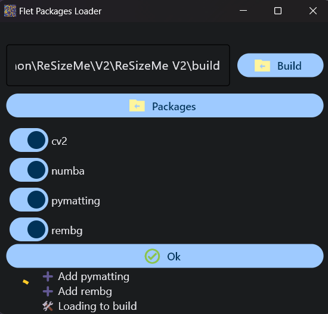
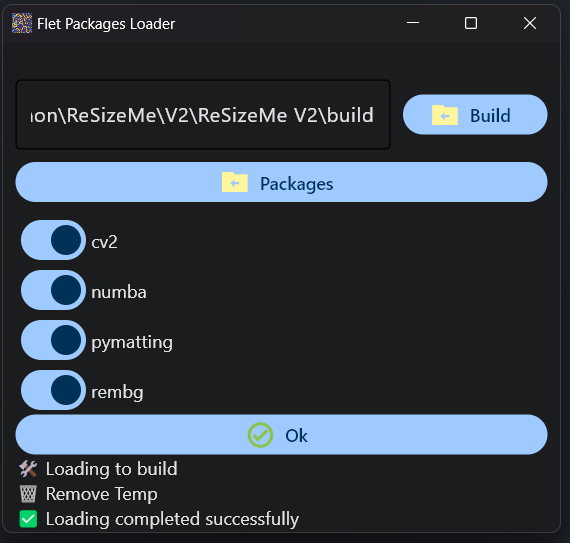

# A flet-packages-loader Flet app

Tool to load dependencies in Flet windows builds.
This program is the implementation of the solution to the [Issue](https://github.com/flet-dev/flet/issues/2714) user's *@ivangermes* problem.
I just used your solution to create this tool..

When loading the packages:



When loading is complete:




To run the app:

```
flet run [app_directory]
```

Or dowload the last relase.